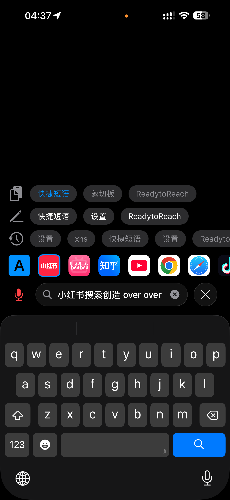

  

# ReadytoReach

## 项目简介
iOS直接搜
### 功能介绍

- **关键词直接搜**  
  - 用 YouTube App 搜索“你好”：输入 `yt 你好`  
  - 用 YouTube 网页 搜索“你好”：输入 `ytw 你好`  

- **语音直接搜**  
  - 直接说“用小红书搜索你好”，自动跳转到小红书 App 搜索结果页
  - 语音指令以“over over”结尾时，自动跳转搜索

- **便捷操作**  
  - 输入框有内容时，点击 Logo 可直接跳转搜索
  - 灵动岛常驻入口，一点即搜，随时随地快速搜索
  - 剪切板、快捷短语、历史记录、无痕搜索...

## 截图

  
  
  
  
  
  
  
  
  

